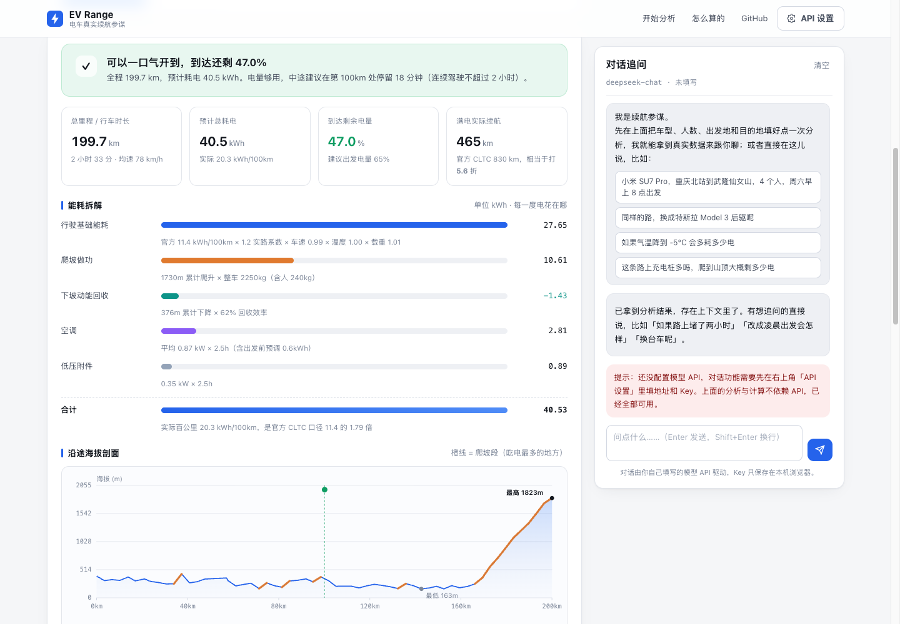
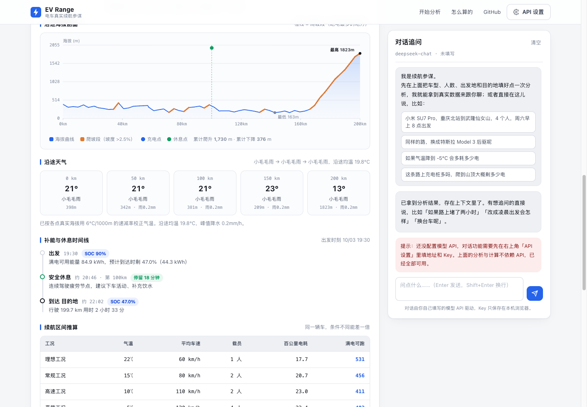
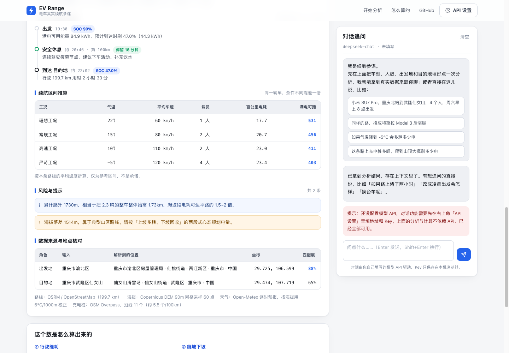
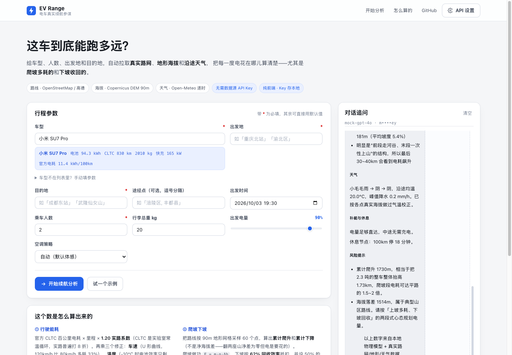

# EV Range · 电车真实续航参谋

> 输入 **车型 + 人数 + 出发地 + 目的地**，自动拉取真实路网、地形海拔和沿途天气，
> 算清楚这一趟**每一度电花在哪儿**——尤其是爬坡多耗的、下坡收回的。

纯前端静态站，零后端、零构建。地图/天气/地形数据全部走开放数据源，**不需要申请任何数据源 Key**；
只有对话功能需要你自己填一个大模型 API（OpenAI 兼容），Key 只存在你自己的浏览器里。

**在线使用**：https://leruo212.github.io/ev-range-agent/ 　·　**示例直通**：[`?demo=1`](https://leruo212.github.io/ev-range-agent/?demo=1)（自动填好参数并跑一遍）


---

## 它到底算什么

不是拿"官方续航 × 0.7"糊弄你。能耗被拆成四项，每一项都能摊开看：

| 项目 | 怎么算的 |
|---|---|
| **行驶基础能耗** | 官方 CLTC 百公里电耗 × 里程 × **1.20 实路系数**，再乘三个修正：车速（U 形曲线）、温度（电池效率）、载重 |
| **爬坡做功** | `E = m·g·Δh`，Δh 用**累计爬升**而不是净海拔差——翻两座山净差为零，电是实打实花掉的 |
| **下坡动能回收** | 累计下降做功 × **62% 回收效率**，并设 50% 的物理上限（不可能越跑电越多） |
| **空调 + 低压附件** | 制热 `0.85+0.085×(20−T)` kW、制冷 `0.55+0.055×(T−26)` kW，乘以实际行驶小时数 |

整车质量包含乘员与行李，一起参与爬坡计算——**这是"多坐两个人到底费多少电"的正解**。

### 三条实测标定曲线

**车速**（以 80km/h 为 1.0，电车能耗是 U 形：低速附件占比高，高速风阻 ∝ v² 主导）

```
0→1.08   30→0.97   60→0.93   80→1.00   100→1.14   120→1.33   140→1.55
```

**温度**（-10℃ 电池效率只剩 77%，这是"冬天少跑一百公里"的主因之一）

```
-20→0.68  -10→0.77   0→0.86   10→0.94   20→1.00   30→0.985  40→0.93
```

**降水的滚阻附加**：小雨 +3%、大雨 +10%。

### 补能与休息

长途按 **20% → 80%** 这个快充效率拐点切段，单段不低于 SOC 15%；
补能时间按快充峰值功率的 **72%** 折算（20→80% 的平均功率就是峰值打七折左右），再加 6 分钟插拔排队。
休息按「连续驾驶不超过 2 小时或 200km」取节点，并把休息点与充电点**取并集合并**——
不让你"休息 18 分钟、再充电 30 分钟"来回折腾两次。

进山路线会额外提示：上坡段电耗可达平路 1.5~2 倍，**山区桩稀，进山前把电补到 85% 以上**。



---

## 海拔剖面：橙线就是吃电的地方

路线按 90m 地形网格等距采样 60 点，算出累计爬升/下降，并把**坡度 >2.5% 的爬坡段用橙色加粗描出来**——
一眼就能看到这一趟的电是在哪 30 公里被吃掉的。

剖面计算前必须做滑动平均平滑。地形网格在平地上也有 ±10m 级别的噪声，
不平滑的话每一点抖动都会被累加成"爬升"——实测：**一条纯平路会被算成 236m 的爬升**，
滑窗平滑后降到 47m（下降 80%）。代价是真实坡度被系统性低估约 3.4%，这个偏差是刻意接受的：
高估爬坡会让你的电量预估偏保守，宁可让你多充一次电，不要让你在山顶上没电。



实测一例（重庆渝北 → 武隆仙女山，199.7km）：前 150km 全程走河谷，海拔在 160~400m 之间反复；
最后 30km 从武隆城区一次性爬升到仙女山镇。累计爬升 1730m、下降仅 376m ——
于是 40.5 kWh 里有 **10.6 kWh 纯粹花在爬山**，而下坡只还回来 1.4 kWh。同一辆车在这条路上的
满电续航只有官方 CLTC 的 **5.6 折**。

这个数字用独立数据源复核过：渝北 398m、仙女山镇 1828m，与剖面值一致。



---

## 对话追问（可选）

配置任意 OpenAI 兼容网关后，可以直接用自然语言追问。Agent 走标准的 function-calling 循环，
**所有数字必须来自工具**，模型不许自己编：

| 工具 | 用途 |
|---|---|
| `analyze_trip` | 主力：一次完成路线+海拔+天气+充电桩+能耗拆解+补能方案 |
| `compare_cars` | 同一条路线上横向对比 2~5 款车 |
| `estimate_energy` | 纯模型计算，用于「如果 -5℃」「如果多坐两个人」这类反事实追问 |
| `plan_route` / `get_weather_along_route` / `find_charging_stations` | 单项查询 |
| `search_car_model` | 内置 45 款中国主流电车参数库检索 |

界面会实时显示工具调用轨迹，你能看到它到底查了什么、拿到了什么。



---

## 数据源

| 用途 | 默认（免费、免 Key） | 填了高德 Key 后 |
|---|---|---|
| 地理编码 | Photon (OSM) | 高德 Geocoding |
| 路线规划 | OSRM 公共实例 (OSM) | 高德驾车路径规划 v5 |
| 地形海拔 | Open-Meteo Elevation / Copernicus DEM 90m | 同左 |
| 沿途天气 | Open-Meteo 逐时预报 | 同左 |
| 充电桩 | Overpass API (OSM `amenity=charging_station`) | 高德周边 POI |

高德只影响**路线与 POI 的国内准确度**，天气和地形始终走 Open-Meteo。
任何一个数据源挂掉都会降级并**如实告诉你降级了**，而不是悄悄给个假数。

### 中文地理编码踩的坑（这层不是锦上添花，是必需品）

Photon 对长中文串的相关性排序很不友好：

- `lang=zh` 参数不被支持，会直接 **HTTP 400**（只支持 default/de/en/fr，中文地名本来就在 OSM 的 name 标签里）
- `重庆市武隆区` 会被匹配到**渝北区**的 POI（因为"重庆市"前缀权重过高）
- `杭州西湖` 会被匹配到**高雄市**的同名地物
- `宜昌三峡大坝` 会被匹配到 40km 外的**宜昌三峡机场**

所以 `js/geo.js` 里做了一层客户端纠偏：

1. **切词**：按行政后缀把查询切成 `["重庆","武隆","仙女山"]`
2. **找锚点**：用前缀探测出地理锚点（城市名），失败时逐级截断前缀直到探到为止
3. **多轮尝试 + 位置偏置**：用锚点坐标给 Photon 加 `lat/lon` 偏置，依次尝试
   `全串 → 去行政后缀 → 掐掉城市前缀的剩余部分 → 首尾拼接 → 末段`
4. **候选打分**：行政字段命中权重（1.0）高于名称命中（0.62），同名异地按与锚点的距离重罚
   （>300km 直接 -0.5，专治"杭州西湖 → 高雄"）

效果：20 个中文地名的实测样本里，20 个都落在正确的城市，其中 19 个 POI 与预期一致
（唯一偏差是不够精准的那个：`乌鲁木齐地窝堡机场` 落在了同城的乌鲁木齐南站）。
结果页会**把解析到的坐标和匹配度摊给你看**，方便你核对——不猜、不藏：

| 输入 | 解析到的位置 | 坐标 | 匹配度 |
|---|---|---|---|
| 重庆市渝北区 | 重庆市渝北区房屋管理局 · 仙桃街道 · 重庆市 | 29.725, 106.599 | 88% |
| 重庆市武隆区仙女山 | 仙女山滑雪场 · 仙女山街道 · 武隆区 | 29.474, 107.719 | 65% |

---

## 快速开始

```bash
git clone https://github.com/Leruo212/ev-range-agent.git
cd ev-range-agent
python3 -m http.server 8788
# 打开 http://localhost:8788/
```

**必须用 HTTP 服务打开**，直接双击 `index.html`（`file://`）会因为 ES module 的跨域限制而白屏。

零依赖、零构建：没有 `package.json`、没有 npm install、没有打包步骤，
所有依赖都是浏览器原生能力 + 手写 SVG 图表。

### 部署到 GitHub Pages

推上去就行，Pages 选 `main` 分支根目录即可。仓库已带 `.nojekyll`（不加它下划线开头的文件会被 Jekyll 吃掉）。

---

## 配置模型 API

点右上角「API 设置」，填三样东西：

| 字段 | 说明 |
|---|---|
| API 地址 | 填到 `/v1` 即可，也可以直接填完整的 `/chat/completions` 端点 |
| API Key | 你的 key |
| 模型名 | 该网关下真实存在的模型 id |

内置了 DeepSeek / 通义千问 / 智谱 GLM / Kimi / 硅基流动 / OpenAI / 本地 Ollama 的预设，点一下就填好。
「测试连接」会先试 `/models`，不支持就退而打一发最小对话，两种路径都通才算连上。

**注意**：模型必须支持 function calling / tool use。不支持时程序会自动降级为纯对话模式并明确提示
（此时它只能聊天，无法自己去查路线和天气）。

### 隐私

没有后端，也就没有"你的 key 被存到别人服务器上"这回事：

- 地址与 Key 只写进这台设备浏览器的 `localStorage`
- 请求由浏览器**直接**发给你选的模型服务商
- 换设备、换浏览器、清缓存都要重填
- 分享链接不会带上你的 Key

---

## 局限与已知问题（先说清楚）

- **这是物理推算，不是实测标定**。误差通常 ±15%，个别车型 / 极端工况更大。
  它擅长回答"上坡到底多吃多少电""冬天这笔账差多少"，**不要拿它当仪表盘用**。
- **海拔来自 90m 网格地形**（Copernicus DEM），与真实路面有 ±10~30m 误差，
  隧道、高架桥的真实路面高程尤其不准。
- **累计爬升的平滑窗口是经验值**（5 点滑窗）。极陡的短坡会被削平，
  缓而长的大坡则算得比较准。
- **充电桩覆盖很不均匀**：OSM 在东部城市尚可、西部和高速服务区缺失严重；
  高德 POI 好得多但需要自备 Key。**出发前请务必用专业充电 App 复核**。
- **没有考虑**：高速服务区排队时间、限速变化、驾驶人个体差异、电池衰减、坡度对滚阻的非线性影响。
- 车型库里 45 款车的参数是**参考值**，不同年款差异很大；界面上允许手动覆盖电池容量与官方续航。
- 地理编码在没有高德 Key 时对**小地名**（村级、新建小区）基本无能为力。

---

## 项目结构

```
ev-range-agent/
├── index.html            # 页面骨架
├── css/style.css         # 全部样式（浅色主题，响应式，带打印样式）
├── js/
│   ├── app.js            # 入口：表单 / 分析 / 对话 / 设置的装配
│   ├── ui.js             # 渲染层：Markdown、海拔剖面 SVG、时间线、拆解条形
│   ├── agent.js          # LLM 客户端 + 工具定义与实现 + Agent 循环
│   ├── trip.js           # 编排：地理编码→路线→海拔→天气→充电桩→模型
│   ├── model.js          # 续航物理模型 + 补能/休息规划算法
│   ├── geo.js            # 数据获取层 + 中文地理编码纠偏
│   ├── evdb.js           # 45 款车型参数库
│   └── config.js         # 本地设置（localStorage）
└── docs/                 # README 配图
```

模块之间是单向依赖：`model.js` 和 `evdb.js` 是纯计算，没有任何网络请求，可以直接在 Node 里跑测试。

---

## 测试情况

| 项目 | 状态 |
|---|---|
| 物理模型数值 | 手工验算：2250kg × 1500m 爬升 = 9.20 kWh，与 `m·g·Δh` 解析解一致 |
| 海拔剖面 | 与独立数据源交叉复核（渝北 398m / 仙女山镇 1828m 均吻合） |
| 累计爬升平滑 | 200 次随机噪声模拟（60 点、±12m 噪声）：纯平路假爬升从 236m 压到 47m；真实坡度的系统性低估约 3.4% |
| 中文地理编码 | 20 个样本实测：20 个落在正确城市，其中 19 个 POI 与预期一致 |
| Agent 工具调用链路 | 端到端验证（本地 mock 网关，无真实 Key）：工具调用 → 数据获取 → markdown 渲染 全线通过 |
| 数据源可用性 | Photon / OSRM / Open-Meteo 均返回 `Access-Control-Allow-Origin: *`，纯静态可直连 |
| Overpass | 部分网络环境下会被拦截或超时，已实现双镜像 + 12s 超时 + 降级提示 |

---

## 免责

续航估算仅供行程参考，实际能耗受驾驶习惯、路况、载重、胎压、电池健康度等众多因素影响。
因参照本工具结果做出决策而产生的任何后果，本项目不承担责任。

## License

[MIT](LICENSE) © 2026 M1r4th0R
